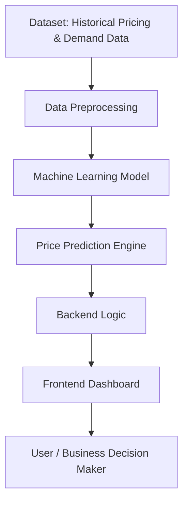

# PriceOptima AI

AI-powered dynamic pricing system that predicts optimal product prices based on demand trends and market data.

## Overview
PriceOptima uses machine learning to analyze demand patterns and recommend optimal pricing strategies.  
The system combines a predictive model with a dashboard interface for visualization.

## Features
- Demand prediction using machine learning
- Dynamic price optimization
- Data visualization dashboard
- Interactive frontend interface

## System Architecture

## Tech Stack

Python  
Machine Learning  
Jupyter Notebook  
React.js  
JavaScript  
CSS  

## How It Works

1. Historical demand data is used to train a pricing model.
2. The model predicts optimal pricing for different demand levels.
3. Results are displayed through a dashboard and frontend interface.

## Future Improvements

- Real-time pricing updates
- Integration with retail platforms
- Advanced AI models

## Author

Sana Shaikh
